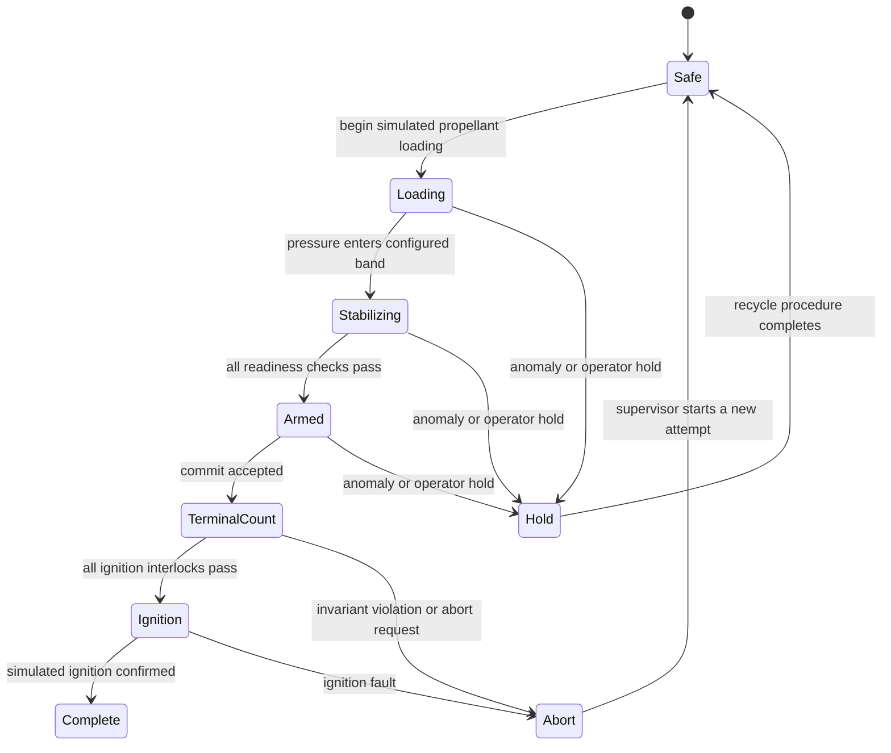
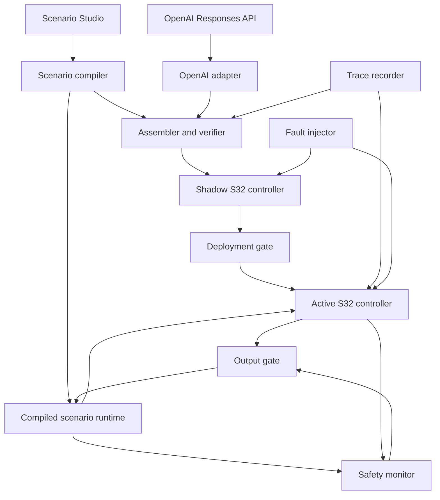

# Sentinel-32 Project Kickstarter

You are bootstrapping **Sentinel-32**, a software-only safety laboratory for AI-generated embedded firmware and customizable mission-critical simulations. The target deployment is a Raspberry Pi 5 running QNX OS 8.0. The implementation language is Rust, cross-compiled with the QNX-modified Rust toolchain.

Your job is **not merely to write code**. Establish a repository that humans and AI coding agents can understand, validate, and continue across independent sessions. Documentation, safety evidence, project planning, architectural context, tests, and implementation are all first-class deliverables.

This document is the initial source of truth. Once the repository is bootstrapped, durable project knowledge must live in the repository rather than in conversation history.

---

# 0. Project Brief

## Project

- **Name:** Sentinel-32
- **Repository / package name:** `sentinel-32`
- **Project type:** Rust workspace containing an emulator, assembler, scenario compiler, safety verifier, QNX services, digital-twin runtime, AI integration, Scenario Studio, and operations dashboard
- **Primary purpose:** Demonstrate how AI-generated embedded firmware can be constrained, verified, observed, and supervised before and during execution in a mission-critical-style system.
- **Demonstration scenario:** A fully software-simulated rocket ground-launch sequencer controlled by a custom MIPS-inspired 32-bit virtual CPU. The same engine can load user-defined scenarios.
- **Primary users:** Hackathon judges, embedded developers, systems programmers, safety engineers, and learners studying low-level systems.
- **Current state:** Assume an empty or minimally initialized repository unless inspection proves otherwise.

## Technology

- **Primary language:** Rust
- **Target OS:** QNX OS 8.0 on Raspberry Pi 5
- **Target architecture:** AArch64
- **Rust target triple:** `aarch64-unknown-nto-qnx800`
- **Host build systems supported by QNX Rust:** Linux and Microsoft Windows
- **Build/package tools:** Cargo, QNX-modified `rustc`, QNX SDP 8.0 tools
- **Native development target:** The developer's ordinary host Rust target for fast unit and property testing
- **Testing:** Rust unit tests, integration tests, golden vectors, property tests where practical, QNX target smoke tests, deterministic trace replay, fault-injection scenarios
- **UI:** Browser dashboard served by a small Rust service, with a text/NDJSON interface retained as a fallback
- **Development agent:** Codex, guided by repository-scoped `AGENTS.md`, the dependency-aware plan, tests, and recorded architectural decisions
- **Runtime AI provider:** OpenAI Responses API through a provider-neutral adapter; Structured Outputs are required for machine-readable proposals, and a fixture provider is required for deterministic tests and offline demonstrations
- **Deployment:** Cross-compile on a supported host, transfer binaries to the Raspberry Pi 5, and run them as separate QNX processes

## Official Toolchain Basis

The implementation must follow the QNX SDP 8.0 Rust documentation:

- QNX supplies a modified `rustc` with QNX support.
- The compiler runs on Linux or Microsoft Windows.
- Cargo use requires linking the QNX Rust toolchain as a custom `rustup` toolchain.
- Raspberry Pi 5 builds use `--target aarch64-unknown-nto-qnx800`.

Reference: [QNX SDP 8.0 `rust` host utility](https://www.qnx.com/developers/docs/8.0/com.qnx.doc.neutrino.utilities/topic/r/rust-host.html)

OpenAI integration must follow the current official documentation:

- [Responses API migration and concepts](https://developers.openai.com/api/docs/guides/migrate-to-responses)
- [Structured model outputs](https://developers.openai.com/api/docs/guides/structured-outputs)
- [Codex project instructions with `AGENTS.md`](https://learn.chatgpt.com/docs/agent-configuration/agents-md)

Pin the selected API model in deployment configuration and evidence rather than hard-coding a model name into safety logic. Before implementation, verify that the selected model supports Structured Outputs through the Responses API.

Do not assume that an ordinary upstream Rust installation is sufficient for QNX deployment. Do not assume native macOS hosting for the QNX-modified Rust compiler. If development begins on macOS, use a supported Linux or Windows build host and record the selected workflow in `docs/development.md`.

## Product Thesis

> AI may propose embedded firmware, but deterministic software decides whether that firmware may execute and whether its outputs may affect the controlled system.

An OpenAI model generates or revises assembly for the S32 virtual processor through the Responses API. Sentinel-32 treats that output as untrusted. It assembles, statically validates, simulates, tests, times, shadows, and supervises the firmware against the active scenario definition. Only firmware associated with passing deterministic evidence may become active. Codex helps build the system, tests, documentation, and review artifacts, but Codex output is subject to the same human review, compilation, and test gates as any other code contribution.

## Fundamental Requirements

1. Implement a deterministic, MIPS-inspired 32-bit instruction set called S32.
2. Implement an assembler with useful, line-specific diagnostics.
3. Implement a bit-exact S32 interpreter with deterministic instruction costs.
4. Implement a schema-driven scenario engine and a default rocket launch-pad digital twin covering cryogenic tank pressure, valve feedback, electrical readiness, ignition continuity, launch-arm, hold, and abort state.
5. Provide a Scenario Studio UI for adding telemetry, valves, switches, electrical channels, phases, transitions, interlocks, failure modes, and safe-state policies without modifying Rust source.
6. Express safety invariants and safe states outside AI-generated firmware.
7. Reject illegal instructions, invalid control flow, protected-memory access, excessive stack use, and execution-budget violations.
8. Maintain separate proposed, shadow, active, and last-known-good firmware and scenario states.
9. Bind validation evidence to the exact assembled firmware hash and compiled scenario hash.
10. Provide deterministic traces and replay.
11. Provide controlled fault injection and visible containment behavior.
12. Integrate the OpenAI Responses API for assembly synthesis, repair, explanation, test suggestions, and optimization proposals using strict Structured Outputs.
13. Never allow an AI response to approve or activate itself.
14. Run the essential control and safety components on QNX 8.0.
15. Keep the core ISA, assembler, VM, scenario compiler, policy engine, and digital-twin runtime portable enough to test on the development host.
16. Isolate QNX-specific FFI and `unsafe` Rust in a narrowly scoped platform crate.
17. Expose a usable dashboard showing source, machine state, scenario state, validation evidence, counterexamples, timing, and faults.

## Important Constraints

- No external electronics, sensors, servos, displays, or GPIO devices are required.
- The Raspberry Pi 5 and development computer are the only expected hardware.
- The rocket, launch pad, propellant system, and electrical system are digital twins, not physical equipment.
- Pressure and electrical values are normalized simulation units by default, not real vehicle operating limits.
- This is a safety-oriented prototype, not certified launch-control software.
- Bounded exploration is not a formal proof and must never be described as one.
- Measured host timing is an observed bound, not a proven worst-case execution time.
- Identical redundant interpreters do not eliminate common-mode software faults.
- AI output is untrusted data at every boundary.
- Codex-generated repository changes are untrusted until reviewed and verified by the relevant build, test, and target-validation commands.
- Scenario definitions are also untrusted until schema validation, semantic validation, safe-state coverage checks, compilation, and hashing succeed.
- Scenario customization must remain declarative; arbitrary executable code is forbidden in scenario files.
- Every safety-relevant actuator added through Scenario Studio must have command semantics, feedback behavior where applicable, and explicit safe-state coverage.
- Dependencies must be kept conservative because QNX support varies across Rust crates.
- Avoid an async runtime for the MVP. Prefer blocking threads, explicit processes, and small protocols.
- The essential controller must remain functional if the AI, UI, validator, or network is unavailable.
- Anything not specified here must not be silently turned into a permanent architectural decision.

---

# 1. Product Behavior

## 1.1 Primary User Flow

1. A user describes a firmware change in natural language.
2. The OpenAI Responses API returns schema-constrained data containing S32 assembly, a summary, assumptions, requested capabilities, and suggested tests.
3. Sentinel-32 parses and assembles the proposal.
4. Static validation checks instruction encoding, control flow, memory access, capabilities, stack bounds, and declared budgets.
5. The verifier runs regression vectors, edge cases, generated scenarios, and bounded digital-twin exploration.
6. The candidate runs in a shadow controller without output authority.
7. Sentinel-32 compares candidate and baseline behavior and records timing and state divergence.
8. A deterministic deployment gate decides whether the candidate may become active. Deployment is locked once the simulated launch system enters its armed phase.
9. The independent safety monitor supervises the active controller at runtime.
10. Any violation blocks ordinary output, enters the defined safe state, records evidence, and optionally restores the last-known-good image.

## 1.2 Demo Narrative

The intended three-minute demonstration is:

1. Run approved firmware in the rocket launch-pad digital twin.
2. Slow execution and show assembly, registers, `HI`, `LO`, `PC`, memory, and the current S32 instruction.
3. Ask the OpenAI model to add a cryogenic pressure-hold rule without weakening abort behavior.
4. Show the candidate assembly and requested capabilities.
5. Validate a deliberately unsafe version and display a minimal counterexample.
6. Ask the OpenAI model to repair the candidate using the deterministic diagnostics and counterexample.
7. Validate and run the repaired image in shadow mode.
8. Activate it through the deployment gate.
9. Inject a corrupted byte and show hash rejection.
10. Stop the AI service and show uninterrupted controller operation.
11. Hang the active controller and show watchdog safe-state activation and rollback.

## 1.3 Launch-System Input Model

The default launch scenario exposes normalized telemetry through scenario-defined S32 memory-mapped channels. Exact physical units and real launch-vehicle thresholds are intentionally out of scope for the MVP. Configured low, nominal, high, and critical bands are part of the scenario policy rather than being hard-coded into AI-generated firmware.

| Default channel ID | Input | Meaning |
|---|---|---|
| `system.state` | `SYSTEM_STATE` | pad connected, launch armed, countdown active, hold, abort latched, range clear |
| `cryo.fuel.pressure` | `CRYO_FUEL_PRESSURE` | normalized fuel-tank pressure, `0..=255` |
| `cryo.oxidizer.pressure` | `CRYO_OX_PRESSURE` | normalized oxidizer-tank pressure, `0..=255` |
| `valves.feedback.*` | `VALVE_FEEDBACK` | fill, vent, isolation, and main-propellant valve position feedback |
| `electrical.*` | `ELECTRICAL_STATE` | primary bus, backup bus, controller power, and ground-power health |
| `ignition.state` | `IGNITION_STATE` | ignition continuity, ignition armed, and ignition feedback |
| `flight_system.state` | `FLIGHT_SYSTEM_STATE` | flight computer ready, telemetry ready, navigation ready, and fault summary |
| `interlocks.*` | `INTERLOCK_STATE` | range clear, pad clear, umbilical state, and remote inhibit |
| `sequence.timer` | `SEQUENCE_TIMER` | countdown or elapsed sequence tick |

The digital twin must support normal values, slow pressure drift, abrupt overpressure, underpressure, stale telemetry, contradictory valve command/feedback, loss of electrical buses, ignition-continuity failure, and asynchronous hold or abort.

## 1.4 Launch-System Output Model

| Default channel ID | Output | Meaning |
|---|---|---|
| `valves.command.*` | `VALVE_COMMAND` | request fill, vent, isolation, and main-propellant valve changes |
| `ignition.command` | `IGNITION_COMMAND` | request ignition arm or simulated fire through the supervisor |
| `sequence.command` | `SEQUENCE_COMMAND` | request continue, hold, recycle, or abort |
| `electrical.command.*` | `POWER_COMMAND` | request simulated primary, backup, or ground-power transitions |
| `controller.status` | `STATUS_OUTPUT` | controller mode and diagnostic status |

S32 firmware writes requests, not physical authority. The independent output gate evaluates every request against current telemetry, invariant state, firmware approval, compiled scenario policy, and the abort latch before the digital twin accepts it.

## 1.5 Launch Sequence Phases

The digital twin uses an explicit state machine. Firmware may request transitions, but the supervisor authorizes them.



`Abort` is latched within a launch attempt. S32 firmware cannot transition directly from `Abort` back to an armed or countdown state. The supervisor must begin a new simulated attempt.

## 1.6 Scenario-Driven System Model

The launch system must not be hard-coded into the VM or safety engine. It is the bundled default scenario for a generic scenario definition system.

A scenario defines:

- typed telemetry channels such as pressure, temperature, voltage, current, continuity, readiness, and discrete state;
- actuators such as valves, electrical switches, relays, inhibits, sequence commands, and irreversible requests;
- optional command-to-feedback relationships and transition timeouts;
- operating phases and permitted transitions;
- invariants, interlocks, mutual-exclusion groups, and latches;
- phase-specific and hazard-specific safe states;
- simplified deterministic dynamics for the digital twin;
- fault models and test scenarios;
- generated symbols and memory-mapped I/O assignments;
- dashboard layout metadata.

Adding a new valve or switch must require a scenario edit and validation, not changes to the S32 emulator. The scenario compiler generates the runtime model, I/O symbol table, validation graph, default dashboard controls, and firmware include file.

## 1.7 Scenario Definition Schema

Use a versioned, declarative schema. YAML may be used for authoring and JSON for canonical serialization, but the canonical representation used for hashing must be deterministic.

An abbreviated example:

```yaml
schema_version: 1
scenario:
  id: rocket-launch-default
  name: Rocket Launch Sequencer

telemetry:
  - id: cryo.fuel.pressure
    type: analog_u32
    unit: normalized_pressure
    range: { min: 0, max: 255 }
    bands:
      low: { max_exclusive: 80 }
      ignition: { min_inclusive: 100, max_inclusive: 180 }
      critical_high: { min_inclusive: 220 }
    stale_after_ticks: 3

actuators:
  - id: valves.fuel_fill
    type: discrete
    states: [closed, open]
    command_initial: closed
    feedback: valves.feedback.fuel_fill
    transition_timeout_ticks: 5
    mutual_exclusion_groups: [fill_vs_ignition]
    safe_state_required: true

  - id: ignition.fire
    type: irreversible_request
    command_initial: blocked
    supervisor_authorization: required
    mutual_exclusion_groups: [fill_vs_ignition]
    safe_state_required: true

phases:
  - id: safe
  - id: loading
  - id: stabilizing
  - id: armed
  - id: terminal_count
  - id: ignition
  - id: abort
    terminal_for_attempt: true

invariants:
  - id: ignition_requires_pressure_band
    severity: abort
    when: command("ignition.fire") == requested
    require:
      all:
        - telemetry("cryo.fuel.pressure") in band("ignition")
        - telemetry("cryo.oxidizer.pressure") in band("ignition")

safe_states:
  - id: abort_default
    applies_when: phase("abort")
    actions:
      ignition.fire: blocked
      valves.fuel_fill: closed
      valves.oxidizer_fill: closed
      sequence.command: abort_latched
```

The final schema syntax may differ, but it must remain typed and declarative. Scenario files must not contain arbitrary Rust, JavaScript, shell, or dynamically loaded native code.

## 1.8 Scenario Studio UI

Provide a dedicated Scenario Studio separate from the live operations dashboard.

### System Registry

- Add, clone, rename, and remove telemetry channels and actuators.
- Select data type, units, range, initial value, staleness timeout, and display formatting.
- Define valve/switch states and optional command feedback.
- Mark actions as reversible, latched, privileged, or irreversible.

### System Graph

- Display telemetry, controllers, actuators, feedback links, and interlocks as a graph.
- Detect dangling references and cycles that are not explicitly permitted.
- Let users organize visual groups without changing semantic IDs.

### Phase Editor

- Create phases and allowed transitions.
- Define entry conditions, completion conditions, timeout behavior, and terminal states.
- Prevent undeclared transitions at runtime.

### Safety Rule Builder

- Build typed boolean expressions using channels, bands, phase, command requests, feedback, timers, and health state.
- Select deterministic responses such as inhibit, hold, abort, force value, or supervisor review.
- Display a plain-language rendering beside the canonical expression.
- Reject unit mismatches, unknown identifiers, and non-total expressions.

### Safe-State Matrix

- Show every actuator against normal, hold, abort, stale-data, controller-loss, electrical-loss, and user-defined hazard profiles.
- Require an explicit action for every safety-relevant actuator in every reachable emergency profile.
- Permit `preserve_current` only when explicitly allowed and justified.
- Reject contradictory actions at the same priority.
- Preview the resolved safe state for any selected phase and fault combination.

### Simulation and Fault Studio

- Define deterministic telemetry timelines and actuator dynamics.
- Inject drift, step changes, stale data, stuck feedback, delayed transitions, electrical loss, and controller failure.
- Save scenarios as repeatable fixtures.

### Compile and Publish

- Validate the draft and show all errors before publication.
- Preview generated memory addresses and S32 symbols.
- Compile the scenario into an immutable runtime bundle.
- Generate a canonical hash and version.
- Require firmware to declare the exact compiled scenario hash.
- Prohibit scenario edits or publication while a launch attempt is armed.

## 1.9 Safe-State Resolution

Safe state is data-driven and phase-aware. It must not be a single hard-coded vector.

Resolution order is deterministic:

1. global emergency and supervisor overrides;
2. active latched-abort policy;
3. matching hazard-specific policy by explicit priority;
4. current-phase safe-state policy;
5. actuator default safe action.

Scenario compilation fails if:

- a safety-relevant actuator is uncovered;
- two rules at the same priority command different values;
- an irreversible action can be selected as a safe action without explicit authorization;
- a referenced phase, channel, actuator, unit, band, or state does not exist;
- pressure or numeric bands overlap ambiguously;
- a non-terminal phase has no permitted recovery or failure transition;
- a safety rule depends on an unbounded or nondeterministic expression.

---

# 2. Safety, Reliability, Accuracy, and Security Model

## 2.1 Safety Invariants

The initial immutable policies are:

- **S32-SAF-001:** Ignition fire is forbidden unless launch is armed, the range and pad are clear, the flight system is ready, electrical power is healthy, ignition continuity is confirmed, and both cryogenic pressure readings are within configured ignition bands.
- **S32-SAF-002:** Ignition fire is forbidden while either fill valve is commanded open or while required main-propellant valve feedback disagrees with the expected launch configuration.
- **S32-SAF-003:** A pressure reading in the configured critical-high band forces abort, closes fill requests, blocks ignition, and requests the configured vent response.
- **S32-SAF-004:** A pressure reading below the configured ignition minimum blocks countdown progression and ignition.
- **S32-SAF-005:** Valve-command and valve-feedback disagreement beyond the configured transition timeout forces hold or abort according to policy.
- **S32-SAF-006:** Loss of both primary and backup electrical readiness blocks arming and forces abort if already armed.
- **S32-SAF-007:** Loss of ignition continuity after arming blocks ignition and latches hold or abort according to the current phase.
- **S32-SAF-008:** A hold request freezes countdown progression and prevents new irreversible actions.
- **S32-SAF-009:** Once asserted, the abort latch cannot be cleared by S32 firmware during the current launch attempt.
- **S32-SAF-010:** Failure to complete a control step within the virtual cycle budget forces the safe state.
- **S32-SAF-011:** Loss or staleness of the host heartbeat forces the safe state.
- **S32-SAF-012:** Candidate firmware may not write supervisor or safety-override registers.
- **S32-SAF-013:** Only bytecode matching approved evidence may be activated, and firmware activation is forbidden after the launch system becomes armed.

The default rocket scenario's abort safe-state profile is:

```text
ignition request        = blocked
launch sequence         = abort latched
fill requests           = closed
main-propellant request = closed unless phase policy requires otherwise
vent request            = policy-controlled safe vent
normal output           = blocked
diagnostic alarm        = active
```

The vent and main-valve portions of the safe state must be decided by the deterministic phase policy. Sentinel-32 must not pretend that one valve position is universally safe for every simulated pressure and launch phase.

The project must document when this safe state is entered, how it is maintained, and what conditions permit recovery.

## 2.2 Initial Hazard Analysis

| Hazard | Example causes | Deterministic mitigation | Required evidence |
|---|---|---|---|
| Ignition outside permitted state | AI bug, corrupt jump, stale readiness | Output gate blocks ignition unless every interlock is true | Negative ignition tests and runtime denial trace |
| Ignition during propellant loading | Incorrect phase logic or fill-valve command | Mutual exclusion between fill and ignition requests | Transition exploration within the configured depth |
| Cryogenic overpressure | Simulated valve failure, sensor drift, controller delay | Abort latch, fill-close request, ignition inhibit, phase-specific vent policy | Counterexample and safe-state trace |
| Unsafe underpressure launch | Incorrect threshold handling | Launch commit and ignition blocked outside configured band | Boundary tests at every band edge |
| Valve command disagrees with feedback | Stuck valve, delayed transition, stale telemetry | Timed disagreement monitor triggers hold or abort | Fault-injection timing evidence |
| Electrical loss during armed phase | Primary and backup bus loss | Ignition inhibit and abort | Power-loss scenario trace |
| Lost ignition continuity | Wiring or simulated igniter fault | Hold or abort; fire command blocked | Continuity-loss scenario trace |
| Unauthorized firmware activation | AI request or corrupted candidate | Hash-bound evidence and armed-phase deployment lock | Hash-corruption and activation-denial tests |
| Controller stall | Infinite loop or process failure | Virtual cycle budget and QNX watchdog | Deadline and watchdog evidence |

Hazards, policies, and evidence identifiers must remain traceable in `docs/safety-model.md`. If a new hazard is added, create or update the relevant tasks and tests before treating its mitigation as implemented.

## 2.3 Trusted Computing Base

Treat only the following as trusted:

- S32 decoder and execution semantics
- Memory and control-flow checks
- Safety-invariant evaluator
- Output gate
- Firmware hash and evidence verification
- Watchdog and safe-state transition

Treat these as untrusted or non-authoritative:

- OpenAI API responses and all model output
- Codex-generated source, tests, documentation, and configuration until independently reviewed and verified
- Candidate assembly
- AI explanations and generated test suggestions
- Dashboard
- User-provided source
- Network input
- Candidate controller process

Keep the trusted computing base small, deterministic, and extensively tested.

## 2.4 Accuracy Requirements

Accuracy means exact and reproducible software behavior, not confidence from the AI.

- Every instruction has documented encoding, register effects, `HI`/`LO` behavior, traps, and cycle cost.
- Thirty-two-bit unsigned arithmetic wraps modulo 2^32 unless the instruction definition states otherwise; signed overflow behavior is specified per instruction.
- Golden vectors cover normal, boundary, carry, borrow, zero, and negative cases.
- The same trace replayed with the same firmware and inputs must reproduce the same VM states and outputs.
- Validation evidence includes the firmware hash, policy version, verifier version, scenario count, and observed bounds.
- A candidate-versus-reference mismatch is a failure even when external outputs happen to match.
- AI explanations must be labeled as AI-generated narrative, distinct from deterministic evidence.

## 2.5 Reliability and Availability

- AI failure must not stop active control.
- UI failure must not stop active control.
- Validation failure must leave active firmware unchanged.
- Candidate failure must remain contained to the candidate process.
- Active-controller failure must be detected by a watchdog.
- Safe-state behavior must remain available without the AI or network.
- The last-known-good image and evidence must remain available for rollback.
- A component must not claim health by repeating a stale heartbeat sequence.

## 2.6 Security Boundaries

- Enforce least privilege through a firmware capability manifest.
- Validate every decoded instruction and every memory access.
- Reject jumps outside executable memory or into the middle of an instruction.
- Reject oversized code, invalid stack behavior, unknown opcodes, and self-modification.
- Do not allow the AI provider to reach QNX safety or output interfaces directly.
- Keep `OPENAI_API_KEY` only in the non-real-time AI adapter process or development-host relay. Never expose it to the controller, VM, scenario bundle, UI, firmware, logs, traces, or evidence artifacts.
- Treat scenario names, descriptions, diagnostics, and user prompts as untrusted content. Delimit them as data in the API request and never allow them to override the system contract.
- Enforce request timeouts, response-size limits, bounded retries outside the control loop, and explicit handling for refusal, incomplete output, rate limiting, network failure, and schema failure.
- Hash assembled bytecode after validation and verify the hash again before activation.
- Parse all IPC and AI responses defensively, including lengths and enum values.

## 2.7 Honest Claims

The README and presentation must explicitly state:

- Sentinel-32 demonstrates safety-oriented architecture; it is not safety certified.
- Raspberry Pi 5 is not being represented as certified launch-control hardware.
- The normalized cryogenic, valve, ignition, and electrical models are educational simulations and must not be used as real vehicle operating procedures or thresholds.
- Bounded exploration covers reported scenarios and depths only.
- Observed timing does not prove universal worst-case timing.
- Software redundancy has common-mode limitations.

---

# 3. S32 Architecture v0

S32 is inspired by the regular encoding and register model of MIPS, but it is a project-specific virtual ISA. It is not binary compatible with MIPS and must not be presented as a MIPS emulator.

## 3.1 Machine State

- Thirty-two 32-bit general-purpose registers numbered `R0` through `R31`
- `R0` is hardwired to zero; writes are discarded
- Conventional aliases may include `R29 = SP`, `R30 = FP`, and `R31 = RA`, but aliases do not change architectural behavior
- Dedicated 32-bit `HI` and `LO` registers for multiply/divide results
- 32-bit program counter `PC`, always aligned to a four-byte instruction boundary
- 32-bit byte-addressed virtual address space
- Fixed-width 32-bit instruction words
- Little-endian data representation
- No architectural condition-code flags; comparisons and conditional branches use registers directly
- No branch delay slots
- Deterministic virtual cycle counter
- Trap cause, halt state, and supervisor-observed health state

The phrase "registers 0-32" is interpreted as 32 general-purpose registers numbered `0..=31`, matching the familiar MIPS model. `HI`, `LO`, and `PC` are additional dedicated registers.

## 3.2 Memory Map

S32 uses fixed region classes but lets the scenario compiler allocate individual memory-mapped I/O channels within those regions.

| Range | Purpose | Firmware permission |
|---|---|---|
| `0x0000_0000..=0x000F_FFFF` | Program image | Execute and read |
| `0x1000_0000..=0x100F_FFFF` | Data and heap | Read and write |
| `0x2000_0000..=0x200F_FFFF` | Stack | Read and write |
| `0x4000_0000..=0x400F_FFFF` | Scenario telemetry channels | Read only |
| `0x5000_0000..=0x500F_FFFF` | Scenario actuator command requests | Write only |
| `0x6000_0000..=0x600F_FFFF` | Actuator feedback and diagnostics | Read only |
| `0x7000_0000..=0x7000_FFFF` | Supervisor state, phase, health, and policy result | Read only |
| `0xF000_0000..=0xF000_FFFF` | Safety override and system control | Supervisor only |

Each scenario channel occupies one or more aligned 32-bit slots described by a generated symbol table. Firmware uses symbolic labels from the generated include file instead of relying on manually assigned addresses. Regions not explicitly mapped by the loaded program and scenario trap on access.

## 3.3 Instruction Formats

All instructions are one aligned 32-bit word.

```text
R-type: opcode[31:26] rs[25:21] rt[20:16] rd[15:11] shamt[10:6] funct[5:0]
I-type: opcode[31:26] rs[25:21] rt[20:16] immediate[15:0]
J-type: opcode[31:26] target[25:0]
```

The detailed binary encoding remains canonical in `docs/s32-isa.md`. The initial assembler may accept MIPS-like syntax while enforcing S32 semantics.

## 3.4 Initial Instruction Set

| Group | Instructions | Required behavior |
|---|---|---|
| Arithmetic | `ADD`, `ADDU`, `SUB`, `SUBU`, `ADDI`, `ADDIU` | Signed forms trap on overflow; unsigned forms wrap modulo 2^32 |
| Logic | `AND`, `OR`, `XOR`, `NOR`, `ANDI`, `ORI`, `XORI` | Bit-exact 32-bit behavior |
| Compare | `SLT`, `SLTU`, `SLTI`, `SLTIU` | Write `0` or `1` to the destination register |
| Shift | `SLL`, `SRL`, `SRA`, `SLLV`, `SRLV`, `SRAV` | Shift amount masked according to the ISA specification |
| Constants | `LUI` | Load upper 16 bits; assembler may provide documented pseudo-instructions |
| Multiply/divide | `MULT`, `MULTU`, `DIV`, `DIVU`, `MFHI`, `MFLO`, `MTHI`, `MTLO` | Results use `HI:LO`; divide by zero traps |
| Memory | `LW`, `SW`, `LB`, `LBU`, `SB`, `LH`, `LHU`, `SH` | Aligned word/halfword access; misalignment traps |
| Branch | `BEQ`, `BNE`, `BLTZ`, `BGEZ` | PC-relative branches with no delay slot |
| Jump/call | `J`, `JAL`, `JR`, `JALR` | Four-byte-aligned targets; `JAL`/`JALR` write return address |
| Control | `NOP`, `HALT`, `TRAP` | Deterministic stop or explicit trap |

Every instruction has an explicit virtual cycle cost. Unassigned encodings, executable-region violations, misaligned access, division by zero, signed overflow where specified, and supervisor-region access trap deterministically.

## 3.5 Firmware Manifest

## 3.4 Firmware Manifest

Each candidate must include or be paired with a manifest similar to:

```yaml
name: launch-sequencer
scenario_id: rocket-launch-default
scenario_hash: "<compiled-scenario-sha256>"
entry_point: 0x00000000
maximum_program_bytes: 65536
maximum_stack_bytes: 16384
control_deadline_cycles: 5000
capabilities:
  read:
    - cryo.fuel.pressure
    - cryo.oxidizer.pressure
    - valves.feedback.*
    - electrical.*
  write:
    - valves.command.*
    - sequence.command
required_properties:
  - abort_is_latched
  - ignition_requires_all_interlocks
  - critical_pressure_blocks_ignition
  - valve_feedback_matches_launch_phase
  - electrical_loss_prevents_launch_commit
```

The AI may propose a manifest. System policy has final authority and may only reduce, never expand, AI-requested permissions.

---

# 4. Runtime Architecture



## 4.1 Initial Process Boundaries

The long-term QNX runtime uses separate processes for:

- safety monitor and output gate;
- active controller;
- shadow/candidate controller;
- compiled scenario runtime and digital twin;
- scenario compiler and immutable bundle store;
- verifier and deployment gate;
- AI adapter;
- operations dashboard, Scenario Studio, and trace access.

The first host-native milestone may run these as modules or threads for speed of development. Process separation on QNX is a required milestone, not an optional architectural aspiration.

The OpenAI adapter is never part of the real-time control path. The preferred final deployment runs it as a low-priority, network-capable QNX process only after HTTPS and dependency compatibility are proven. The hackathon-safe fallback is a development-host relay that calls the OpenAI API and exchanges only versioned proposal messages with QNX. In either arrangement, loss of the relay, DNS, TLS, API access, or the configured model must not disturb active control.

## 4.2 Priority Intent

Initial relative priority, subject to measurement and documentation:

1. Safety monitor and output gate
2. Digital-twin clock and active controller
3. Active trace transport
4. Shadow controller
5. Verifier
6. Operations dashboard and Scenario Studio
7. AI adapter

AI computation must never delay the essential controller path. Record actual scheduling policy and numeric priorities only after confirming them on the target.

## 4.3 QNX Platform Adapter

Create one narrowly scoped crate for QNX-specific operations. It may expose safe Rust wrappers for:

- monotonic or cycle timing;
- process/thread priority setup;
- CPU affinity if used;
- native QNX message passing;
- process health and heartbeat support;
- controlled shutdown.

Prefer a minimal C shim compiled with QNX headers if direct Rust declarations would require fragile handwritten ABI definitions. All `unsafe` blocks must:

- remain inside the platform adapter where practical;
- include a `// SAFETY:` explanation;
- validate pointer, length, lifetime, and return-code assumptions;
- have host-testable safe wrappers where possible.

The core VM and verifier must not depend directly on raw QNX FFI.

---

# 5. Rust and QNX Build Strategy

## 5.1 Toolchain Rules

The QNX documentation states that the modified compiler is used directly or through Cargo after registering it as a custom rustup toolchain. Use the documented target triple:

```text
aarch64-unknown-nto-qnx800
```

The eventual build command should follow this shape:

```sh
cargo +<QNX_CUSTOM_TOOLCHAIN> build \
  --target aarch64-unknown-nto-qnx800 \
  --release
```

Do not hardcode a guessed toolchain name or installation path. During `BUILD-001`, record the actual installation, rustup link command, environment initialization, compiler version, linker behavior, and successful hello-world command in `docs/development.md`.

## 5.2 Host and Target Validation

Use two validation lanes:

### Host-native lane

Runs frequently and without QNX:

```sh
cargo fmt --check
cargo clippy --workspace --all-targets -- -D warnings
cargo test --workspace
```

### QNX target lane

Runs when the QNX environment is available:

```sh
cargo +<QNX_CUSTOM_TOOLCHAIN> build \
  --workspace \
  --target aarch64-unknown-nto-qnx800 \
  --release
```

Then transfer the selected binaries to the Pi, execute target smoke tests, and record the tested commit, toolchain, target image, and result.

## 5.3 Conditional Compilation

Do not guess Rust `cfg` values for QNX. During the toolchain spike, capture:

```sh
rustc +<QNX_CUSTOM_TOOLCHAIN> \
  --print cfg \
  --target aarch64-unknown-nto-qnx800
```

Use those observed values in code and documentation. Prefer an explicit Cargo feature such as `qnx-platform` until the target configuration is confirmed.

## 5.4 Dependency Policy

Prefer:

- Rust standard library;
- small pure-Rust crates;
- crates already verified against the QNX target;
- blocking I/O and explicit threads for the MVP;
- committed `Cargo.lock`.

Avoid for the MVP:

- large async stacks;
- dependencies with deep native build chains;
- crates that assume Linux-specific APIs;
- unnecessary proc-macro or serialization frameworks;
- adding a dependency for a trivial utility.

Every dependency must build in the host-native lane. Target-facing dependencies must also pass a QNX cross-build before the task using them can be completed.

---

# 6. Proposed Repository Structure

```text
/
├── AGENTS.md
├── Cargo.toml
├── Cargo.lock
├── README.md
├── rustfmt.toml
├── .cargo/
│   └── config.toml
├── .agent/
│   ├── plan.md
│   └── context.md
├── crates/
│   ├── sentinel-core/       # ISA, assembler, VM, traps, trace model
│   ├── sentinel-scenario/   # schema, compiler, address allocation, runtime model
│   ├── sentinel-safety/     # generic policy engine, verifier, evidence
│   ├── sentinel-protocol/   # versioned messages and DTOs
│   ├── sentinel-qnx/        # QNX platform adapter and FFI boundary
│   ├── sentinel-ai/         # provider trait, fixtures, OpenAI Responses adapter
│   └── sentinel-app/        # binaries, orchestration, dashboard server
├── web/
│   ├── index.html
│   ├── app.js
│   └── style.css
├── examples/
│   ├── safe-launch-sequence.s32
│   ├── unsafe-ignition-bypass.s32
│   ├── cryogenic-pressure-hold.s32
│   └── scenarios/
│       └── rocket-launch-default.yaml
├── fixtures/
│   ├── ai/
│   ├── traces/
│   └── scenarios/
├── docs/
│   ├── project.md
│   ├── architecture.md
│   ├── development.md
│   ├── configuration.md
│   ├── s32-isa.md
│   ├── scenario-schema.md
│   ├── safety-model.md
│   ├── threat-model.md
│   ├── validation.md
│   ├── demo.md
│   └── decisions/
└── scripts/
    ├── deploy-qnx.sh
    ├── smoke-qnx.sh
    └── check.sh
```

Adjust the structure after inspecting the repository. Do not create empty documents or scripts merely to match this tree.

---

# 7. Module Responsibilities

## `sentinel-core`

- No AI, UI, network, or QNX dependencies.
- Defines S32 types, decoder, encoder, assembler, machine state, execution, traps, cycle accounting, trace events, and firmware hashing input.
- Must be deterministic and heavily unit tested.
- Forbid `unsafe` code unless a documented decision explicitly changes this rule.

## `sentinel-safety`

- Evaluates compiled typed invariants and resolves phase/hazard-specific safe states.
- Runs scenario simulation, bounded exploration, candidate comparison, and evidence generation without hard-coded rocket identifiers.
- Owns safe-state policy but not AI narrative.

## `sentinel-scenario`

- Defines and validates the versioned scenario schema.
- Compiles telemetry, actuators, feedback, phases, rules, safe states, dynamics, and faults into an immutable runtime bundle.
- Allocates deterministic memory-mapped I/O addresses and generates S32 symbols.
- Provides the generic digital-twin runtime used by the default rocket profile and future scenarios.
- Rejects incomplete safe-state coverage, ambiguous rules, invalid units, dangling references, and nondeterministic expressions.

## `sentinel-protocol`

- Defines versioned request and response messages between services.
- Rejects invalid lengths, versions, enum values, and state transitions.
- Must not expose internal pointers or platform handles.

## `sentinel-qnx`

- Owns target-specific code, FFI, timing, priority, affinity, and QNX IPC wrappers.
- Provides a host fallback or mock where practical.
- Contains and documents nearly all `unsafe` code.

## `sentinel-ai`

- Defines an `AiProvider` trait.
- Includes a deterministic fixture provider.
- Implements an `OpenAiResponsesProvider` behind the provider-neutral boundary.
- Requests Structured Outputs and parses the response into the local strict schema.
- Records the configured model, prompt-contract version, response identifier when available, latency, and outcome without recording secrets or unnecessary prompt content.
- Handles refusal, incomplete output, timeout, rate-limit, transport, size-limit, and schema errors as typed non-safety-critical failures.
- Never activates firmware or marks it safe.
- Redacts secrets from logs.

## `sentinel-app`

- Contains process entry points and orchestration.
- Serves the operations dashboard, Scenario Studio, and event stream.
- Connects services through `sentinel-protocol`.
- Must keep the essential controller path independent of the web UI.

---

# 8. Codex and OpenAI Integration

## 8.1 Codex Development Workflow

Codex is the primary coding agent for repository work. `AGENTS.md` is the canonical agent instruction file and must contain the project invariants, required verification commands, file ownership guidance, QNX limitations, and the rule that no AI may claim safety approval. Codex reads repository-scoped `AGENTS.md` before work, so keep durable instructions there and keep task state in `.agent/plan.md` rather than relying on chat history.

For every material Codex change:

1. Inspect the relevant implementation, specification, tests, and decisions first.
2. Associate the work with a task ID and explicit acceptance criteria.
3. Keep generated diffs narrow and reviewable.
4. Run host tests and static checks; run the QNX build or target test when the affected component is target-facing.
5. Record commands and results. A Codex statement that a change is safe or complete is not evidence.
6. Require human review for changes to the ISA, scenario schema, trusted computing base, safety invariants, deployment gate, or secret handling.

Codex may help generate implementation, tests, adversarial cases, documentation, and review notes. It may not waive tests, rewrite acceptance criteria to fit an implementation, mark unavailable target checks as passing, or approve its own safety-relevant change.

## 8.2 Runtime Provider-Neutral Interface

Begin with an interface conceptually equivalent to:

```rust
pub trait AiProvider {
    fn propose_firmware(
        &self,
        request: FirmwareRequest,
    ) -> Result<FirmwareProposal, AiError>;
}
```

Do not allow provider-specific types to leak into the verifier or controller.

The production implementation is `OpenAiResponsesProvider`. Keep `FixtureAiProvider` for offline testing and demonstrations. The provider call must run outside the controller and safety-monitor processes and must never be awaited by a real-time control loop.

## 8.3 OpenAI Responses API Request

Use the Responses API with Structured Outputs via a strict JSON Schema in `text.format`. The request contains:

- a stable developer instruction defining S32 syntax, the response contract, non-authoritative status, and prohibited behavior;
- the exact prompt-contract version;
- the active scenario ID and compiled scenario hash;
- an allowlisted scenario interface summary and generated symbols;
- the requested change;
- deterministic assembler/verifier diagnostics when performing repair;
- explicit output and input size budgets.

Do not give the model direct tools for activation, output control, QNX IPC, file mutation, or secret access. The initial integration needs structured text output, not function calling: the model proposes an artifact and Sentinel-32 independently evaluates it. Scenario-controlled text is quoted and delimited as data so it cannot redefine the developer instruction.

## 8.4 Structured Response

Require a strict response containing:

```json
{
  "schema_version": 1,
  "target_scenario_id": "rocket-launch-default",
  "target_scenario_hash": "<compiled-scenario-sha256>",
  "summary": "Adds a cryogenic pressure hold while preserving the abort latch and ignition interlocks.",
  "assembly": "...",
  "assumptions": ["Pressure values use configured normalized policy bands."],
  "requested_capabilities": ["pressure_input", "valve_feedback", "sequence_output"],
  "suggested_tests": [
    {
      "name": "overpressure_during_terminal_count",
      "description": "Critical pressure must latch abort and prevent ignition."
    }
  ]
}
```

Reject missing or extra fields, excess size, invalid UTF-8, unknown schema versions, unknown scenario channels, stale scenario hashes, and output exceeding configured limits. Handle API refusals and incomplete responses explicitly; neither is a firmware proposal. Structured Outputs provide schema adherence, not semantic correctness or safety. The verifier supplies the authoritative scenario bundle and must not accept a model-invented scenario definition as already approved.

## 8.5 Deterministic Fallback

Commit fixture responses for:

- a valid controller proposal;
- an unsafe proposal;
- malformed JSON;
- illegal opcode generation;
- protected-memory access;
- a repaired proposal.

The fixture provider is required for repeatable tests and demo recovery. It must be clearly identified as a fixture, not presented as a live AI response.

## 8.6 Runtime AI Evaluation

Maintain a small versioned evaluation set covering safe synthesis, unsafe requests, repair from deterministic diagnostics, stale scenario hashes, prompt injection embedded in scenario text, malformed or oversized content, and refusal/incomplete-response handling. Report at least:

- API schema success rate;
- assembly success rate;
- deterministic validation pass rate by case;
- unsafe-candidate rejection rate;
- repair success rate;
- median and maximum observed latency;
- fixture/live parity for the response schema.

These are model-integration quality metrics, not evidence that generated firmware is safe. All safety claims come from the deterministic validation pipeline and are scoped to its recorded coverage.

---

# 9. Evidence and Trace Model

Each validation report must include:

- source and bytecode hashes;
- canonical source-scenario and compiled-scenario hashes;
- firmware manifest;
- S32 ISA version;
- policy version;
- verifier version;
- scenario names and counts;
- exploration depth and number of unique states;
- first or minimal counterexample when available;
- maximum observed virtual cycles;
- host timing observations when available;
- shadow comparison result;
- final deterministic decision and reason codes.

Each execution trace must be sufficient to reproduce:

- starting machine state;
- input byte and world state;
- instruction address and decoded instruction;
- general-purpose register, `HI`, `LO`, and `PC` changes;
- memory writes;
- output writes;
- cycle count;
- traps and invariant evaluations;
- ending state.

Use a versioned trace schema. Canonical machine-state hashing must not depend on map iteration order, timestamps, memory addresses, or process IDs.

---

# 10. Documentation and Agent Operating Model

Use the following repository documents as canonical sources:

| Subject | Canonical location |
|---|---|
| AI working protocol | `AGENTS.md` |
| Product goals and scope | `docs/project.md` |
| Current architecture | `docs/architecture.md` |
| S32 instruction semantics | `docs/s32-isa.md` |
| Scenario schema and compiler behavior | `docs/scenario-schema.md` |
| Safety claims and invariants | `docs/safety-model.md` |
| Threats and trust boundaries | `docs/threat-model.md` |
| Build and QNX workflow | `docs/development.md` |
| Configuration | `docs/configuration.md` |
| Validation methodology | `docs/validation.md` |
| Demo procedure | `docs/demo.md` |
| Historical decisions | `docs/decisions/` |
| Dependency-aware work plan | `.agent/plan.md` |
| Repository navigation cache | `.agent/context.md` |

Avoid duplicate sources of truth. Tool-specific instruction files must point to `AGENTS.md` rather than repeat it.

## Session Start Protocol

At the beginning of meaningful work, an agent must:

1. Read `AGENTS.md`, `.agent/plan.md`, and `.agent/context.md`.
2. Read only the project documents relevant to the requested task.
3. Inspect the existing implementation before modifying it.
4. Select a task ID and verify its dependencies.
5. Identify affected modules, tests, evidence, and documentation.

## Session Completion Protocol

Before declaring work complete:

1. Verify every applicable acceptance criterion.
2. Run formatting, linting, tests, and target checks that are available.
3. Update affected documentation in the same task.
4. Update `.agent/context.md` if responsibilities or structure changed.
5. Update `.agent/plan.md` honestly.
6. Record validation limitations instead of claiming unperformed checks.
7. Report task IDs, changes, validation, documentation, and remaining risks.

---

# 11. Task and Planning Rules

The canonical plan lives in `.agent/plan.md`.

Every meaningful task must contain:

- stable ID;
- title and category;
- description;
- explicit dependencies;
- acceptance criteria;
- notes or linked decisions where useful.

Use these categories:

```text
BOOT-###  repository and documentation bootstrap
BUILD-### Rust/QNX toolchain and deployment
ISA-###   S32 specification and assembler
SCEN-###  scenario schema, compiler, editor, and bundles
VM-###    execution engine and trace
SAFE-###  policies, verifier, evidence, watchdog
TWIN-###  rocket launch-pad digital twin
AI-###    OpenAI Responses API, structured proposals, fixtures, and evals
QNX-###   QNX process, IPC, timing, and priority work
UI-###    dashboard and visualization
TEST-###  testing and fault injection
DOC-###   documentation and presentation
```

Dependencies are mandatory. Do not start a dependent task until its prerequisites are complete. If a missing prerequisite appears, create it rather than silently expanding the task.

---

# 12. Initial Task Graph

The bootstrap agent must convert this graph into the full task format in `.agent/plan.md`.

## Foundation

### BOOT-001 - Inspect and document the repository

- **Dependencies:** None
- Establish canonical documentation and agent files.
- Record existing code instead of overwriting useful work.

### BUILD-001 - Prove Rust cross-compilation for QNX 8.0 AArch64

- **Dependencies:** BOOT-001
- Install or locate the QNX-modified Rust toolchain on a supported host.
- Link it as a custom rustup toolchain.
- Compile a Rust hello-world binary for `aarch64-unknown-nto-qnx800`.
- Run it on the Raspberry Pi 5.
- Record exact reproducible commands and observed `rustc --print cfg` output.

### BOOT-002 - Scaffold the Rust workspace

- **Dependencies:** BOOT-001, BUILD-001
- Create only the crates justified by current architecture.
- Establish host-native checks and a QNX build command.

## ISA and VM

### ISA-001 - Specify S32 ISA v0

- **Dependencies:** BOOT-001
- Complete exact encoding, register semantics, `HI`/`LO` behavior, traps, cycle costs, memory model, and examples.

### ISA-002 - Implement the assembler

- **Dependencies:** ISA-001, BOOT-002
- Support labels, comments, registers, literals, addresses, and line-specific diagnostics.

### VM-001 - Implement the reference interpreter

- **Dependencies:** ISA-001, BOOT-002
- Implement bit-exact instruction behavior, traps, memory permissions, and cycle accounting.

### VM-002 - Implement versioned tracing and deterministic replay

- **Dependencies:** VM-001

## Scenario Engine, Safety, and Digital Twin

### SCEN-001 - Specify the versioned scenario schema

- **Dependencies:** BOOT-001
- Define typed telemetry, actuator, feedback, phase, transition, invariant, safe-state, dynamics, fault, and layout structures.
- Define canonical serialization, versioning, validation errors, and scenario hashing.

### SCEN-002 - Implement the scenario compiler and generic runtime

- **Dependencies:** SCEN-001, BOOT-002
- Allocate deterministic MMIO symbols, compile policies, validate safe-state coverage, and execute deterministic dynamics.

### SCEN-003 - Implement the default rocket launch scenario

- **Dependencies:** SCEN-002
- Express cryogenic pressure, valves, electrical switches, ignition, phases, interlocks, dynamics, safe states, and faults entirely through the scenario schema.

### TWIN-001 - Implement the rocket launch-pad state model

- **Dependencies:** SCEN-003
- Validate that the generic runtime executes the rocket scenario's deterministic pressure, valve, electrical, ignition, countdown, hold, abort, timing, and failure behavior.

### SAFE-001 - Implement invariant evaluation and safe-state output

- **Dependencies:** VM-001, SCEN-002, TWIN-001

### SAFE-002 - Implement firmware manifest and static validation

- **Dependencies:** ISA-002, VM-001

### SAFE-003 - Implement scenario runner and bounded exploration

- **Dependencies:** SAFE-001, SAFE-002, TWIN-001

### SAFE-004 - Implement evidence reports and hash binding

- **Dependencies:** SAFE-002, SAFE-003, VM-002
- Bind evidence to both the firmware hash and compiled scenario hash.

### SAFE-005 - Implement firmware and scenario active, candidate, shadow, and rollback lifecycle

- **Dependencies:** SAFE-004
- Scenario activation must be transactional, hash-bound, forbidden while armed, and capable of returning to the last-known-good compatible firmware/scenario pair.

## AI and UI

### AI-001 - Define the AI provider boundary and fixtures

- **Dependencies:** BOOT-002, ISA-001
- Define the local request/response types, strict JSON Schema, size limits, typed errors, fixture provider, and secret-redaction tests.

### AI-002 - Prove an OpenAI Responses API Structured Output

- **Dependencies:** AI-001
- Make one minimal API request from the intended network-capable environment using `OPENAI_API_KEY` and the configured model.
- Parse a strict Structured Output, record non-secret request metadata, and exercise refusal, incomplete-response, timeout, and invalid-response paths.
- If direct QNX HTTPS or crate compatibility is not proven quickly, document the limitation and implement the development-host relay boundary rather than delaying the deterministic controller.

### AI-003 - Integrate OpenAI firmware synthesis and repair

- **Dependencies:** AI-002, ISA-002, SAFE-002
- Supply scenario identity, generated symbols, capability vocabulary, and deterministic diagnostics to the model.
- Feed the returned proposal only into the assembler and verifier; provide no activation or output-control path.

### AI-004 - Build the AI integration evaluation suite

- **Dependencies:** AI-003, SAFE-003
- Add the versioned evaluation set and report schema success, assembly success, unsafe rejection, repair success, observed latency, and fixture/live schema parity.

### UI-001 - Implement the text/NDJSON observability interface

- **Dependencies:** VM-002, TWIN-001, SAFE-001

### UI-002 - Implement the browser dashboard

- **Dependencies:** UI-001, SAFE-004

### UI-003 - Implement Scenario Studio

- **Dependencies:** SCEN-002, UI-002
- Implement the system registry, graph, phase editor, typed rule builder, safe-state matrix, fault studio, generated-address preview, validation report, and immutable publish workflow.

## QNX and Reliability

### QNX-001 - Implement the platform adapter

- **Dependencies:** BUILD-001, BOOT-002
- Establish minimal timing, scheduling, and process-control wrappers.

### QNX-002 - Split essential runtime components into QNX processes

- **Dependencies:** QNX-001, SAFE-001, SAFE-005, TWIN-001

### QNX-003 - Implement watchdog and heartbeat supervision

- **Dependencies:** QNX-002

### TEST-001 - Build the controlled fault-injection suite

- **Dependencies:** VM-002, SAFE-005, QNX-003

### DOC-001 - Prepare reproducible demo and safety-case summary

- **Dependencies:** AI-004, UI-003, TEST-001

## Critical Path

```text
BOOT-001
  -> BUILD-001
  -> BOOT-002
  -> ISA-001
  -> ISA-002 + VM-001
  -> SCEN-001
  -> SCEN-002
  -> SCEN-003 + TWIN-001
  -> SAFE-001 + SAFE-002
  -> SAFE-003 + VM-002
  -> SAFE-004
  -> SAFE-005
  -> QNX-001
  -> QNX-002
  -> QNX-003
  -> TEST-001
  -> DOC-001
```

AI and UI work may proceed alongside later safety tasks once their dependencies are satisfied.

---

# 13. Minimum Viable Demonstration

The MVP is complete only when all of the following are true:

- A Rust binary has been cross-compiled and executed on QNX 8.0 on Raspberry Pi 5.
- S32 assembly can be assembled with useful diagnostics.
- An S32 program can execute deterministically with `R0..R31`, `HI`, `LO`, `PC`, memory, outputs, traps, and cycle count visible.
- The rocket launch-pad digital twin reacts to controller output without external hardware.
- Cryogenic pressure, valve feedback, ignition continuity, electrical readiness, arm, hold, and abort states are visible and affect deterministic policy decisions.
- Scenario Studio can add at least one valve and one electrical switch, define their feedback and safe-state behavior, compile the scenario, and expose generated S32 symbols without modifying Rust source.
- Scenario compilation rejects a safety-relevant actuator that lacks safe-state coverage.
- Published scenarios are immutable, versioned, hashed, and locked against changes while the simulation is armed.
- At least six immutable rocket-launch safety invariants are enforced outside firmware, including ignition interlock, pressure band, valve feedback, electrical readiness, abort latch, and deadline behavior.
- One safe example passes validation.
- One unsafe example is rejected with a concrete counterexample.
- Protected-memory access is rejected.
- An infinite loop is terminated by a cycle budget.
- Candidate firmware cannot replace active firmware without passing the deployment gate.
- Evidence is bound to the exact candidate firmware hash and compiled scenario hash.
- Stopping the AI component does not stop active control.
- A fixture-backed AI path and a live OpenAI Responses API path share the same schema.
- The live path demonstrates at least one schema-valid proposal and one repair attempt, while API failure falls back to a clearly labeled fixture or manual proposal without affecting active control.
- AI evaluation results are shown separately from deterministic firmware validation evidence.
- The dashboard or fallback interface can present execution and evidence clearly.
- Documentation accurately describes what was and was not validated.

---

# 14. Testing Strategy

## Unit Tests

- One or more vectors for every opcode.
- Arithmetic boundaries, signed-overflow traps, unsigned wrapping, and `HI`/`LO` behavior.
- Encoder/decoder round trips.
- Invalid opcode and invalid target traps.
- Stack bounds.
- Memory permissions.
- Assembler parsing and diagnostics.
- Scenario schema parsing, canonicalization, versioning, and hashing.
- Deterministic MMIO address allocation independent of input map ordering.
- Unit compatibility and numeric-band validation.
- Safe-state matrix completeness and conflict detection.
- Phase-transition reachability and reference validation.
- Invariant truth tables.
- Digital-twin state transitions.
- Launch-phase transition authorization.
- Pressure-band boundary behavior.
- Fill/ignition mutual exclusion.
- Valve-command and valve-feedback timeout behavior.
- Primary and backup electrical-loss handling.
- Ignition-continuity loss before and after arming.
- Abort-latch irreversibility within a launch attempt.
- Manifest capability reduction.
- Canonical state hashing.

## Property Tests

Where dependency support permits:

- decoding never panics for any byte pair;
- encode/decode round trips for valid instructions;
- VM stepping never accesses outside 256-byte memory;
- deterministic replay produces the same final state;
- safety override cannot be cleared by ordinary firmware;
- system policy never grants more capability than configured maximums.
- scenario compilation is deterministic for semantically identical canonical input;
- adding a valid channel cannot change existing symbol addresses when stable allocation mode is enabled;
- every published scenario gives all safety-relevant actuators a resolved action for every reachable emergency profile;
- arbitrary code cannot be embedded through scenario expression fields.

If a property-testing crate does not cross-compile, keep it in host-only development dependencies.

## Integration Tests

- Assemble and run example programs.
- Compile the default launch scenario and generate its S32 symbol table.
- Add a valve and electrical switch through the same scenario-edit API used by Scenario Studio, then compile and run without rebuilding Rust code.
- Reject incomplete, contradictory, unit-invalid, and dangling-reference scenario definitions.
- Validate safe and unsafe launch-sequencer firmware.
- Explore nominal loading, stabilization, arming, terminal-count, ignition, hold, and abort sequences.
- Reject ignition when either pressure channel is outside its configured band.
- Reject ignition when valve feedback, electrical readiness, range/pad clearance, flight readiness, or continuity is invalid.
- Produce and replay traces.
- Bind and verify evidence hashes.
- Compare candidate and active outputs.
- Parse schema-valid OpenAI Structured Outputs and reject malformed, oversized, stale-hash, refused, and incomplete responses.
- Verify timeout, bounded-retry, disabled-mode, fixture-mode, and network-failure behavior without disturbing active control.
- Verify that prompt-injection strings in scenario metadata remain inert data and cannot change the response contract or grant capabilities.
- Verify that secrets and authorization headers never appear in logs, traces, evidence, fixtures, panic messages, or dashboard events.
- Exercise lifecycle transitions.

## QNX Target Tests

- Start each essential process.
- Verify IPC round trips.
- Measure controller and monitor timing.
- Confirm intended priority relationships.
- Kill AI and UI services and observe uninterrupted control.
- Hang or kill the active controller and observe watchdog behavior.
- Verify rollback to last-known-good firmware.

## Fault-Injection Matrix

| Fault | Expected detection | Expected containment |
|---|---|---|
| Illegal opcode | VM decoder | Candidate traps; active unchanged |
| Protected write | Memory policy | Candidate traps; evidence records address |
| Infinite loop | Cycle budget | Candidate stopped; safe state if active |
| Corrupted byte | Hash check | Activation refused |
| Stale heartbeat | Watchdog | Output gate enters safe state |
| Fuel or oxidizer overpressure | Safety monitor | Abort latched; fill closed; ignition blocked; phase policy controls vent request |
| Pressure below launch band | Safety monitor | Countdown held; ignition blocked |
| Valve feedback stuck or delayed | Transition monitor | Hold or abort after configured timeout |
| Both electrical buses unavailable | Safety monitor | Arming blocked or abort latched |
| Ignition continuity lost | Safety monitor | Ignition blocked; hold or abort latched |
| Range or pad clearance revoked | Safety monitor | Countdown held or abort latched; ignition blocked |
| Firmware update requested after arming | Deployment gate | Activation refused; current approved image retained |
| AI crash | Process health | Active control continues |
| UI crash | Process health | Headless control continues |
| Unsafe sensor sequence | Invariant monitor | Output overridden and counterexample recorded |

---

# 15. Configuration

Configuration must be explicit and documented. Initial settings include:

```text
OPENAI_API_KEY                  secret; AI adapter/relay only; never logged
S32_OPENAI_MODEL                required for live mode; pin in demo configuration
S32_OPENAI_TIMEOUT_MS
S32_OPENAI_MAX_OUTPUT_BYTES
S32_AI_MODE                     openai | fixture | disabled
S32_CONTROL_PERIOD_US
S32_HOST_DEADLINE_US
S32_VIRTUAL_CYCLE_BUDGET
S32_HEARTBEAT_PERIOD_MS
S32_HEARTBEAT_TIMEOUT_MS
S32_EXPLORATION_DEPTH
S32_MAX_EXPLORED_STATES
S32_TRACE_PATH
S32_DASHBOARD_BIND
S32_SCENARIO_SOURCE_PATH
S32_SCENARIO_BUNDLE_PATH
```

Define defaults, precedence, validation, secret handling, and target-specific limitations in `docs/configuration.md`. Scenario-specific pressure bands, transition timeouts, channel definitions, and safe states belong in the versioned scenario definition, not environment variables. Unsafe or ambiguous values must fail closed rather than silently changing safety behavior.

Never commit `.env` files or credentials. Inject `OPENAI_API_KEY` into only the process making the HTTPS request. Do not forward it over Sentinel-32 IPC. Validate the configured model's Structured Outputs support at startup of live AI mode, and include the selected model and prompt-contract version in non-authoritative AI provenance metadata.

---

# 16. Coding Standards

- Prefer explicit domain types over raw integers for addresses, opcodes, cycle counts, and firmware hashes.
- Use exhaustive matching for instructions, traps, lifecycle states, and policy decisions.
- Avoid panics in target runtime code. Convert failures into typed errors or controlled traps.
- Forbid unchecked indexing in the VM execution path.
- Keep parsing separate from execution.
- Keep evidence data separate from AI narrative.
- Use deterministic collections or canonical sorting for hashed/serialized evidence.
- Keep functions small around security and safety boundaries.
- Every `unsafe` block requires a specific `SAFETY` comment.
- Public APIs require documentation when their invariants are not obvious.
- Comments explain intent, invariants, or platform constraints, not obvious syntax.
- Documentation and acceptance criteria must change with behavior.

---

# 17. Initial Architectural Decisions to Record

Create decision records for:

- **DEC-001:** Use a custom MIPS-inspired fixed-width 32-bit ISA with 32 GPRs, `HI`, `LO`, and `PC`, without branch delay slots.
- **DEC-002:** Treat AI output as untrusted and non-authoritative.
- **DEC-003:** Keep core execution portable and isolate QNX-specific code.
- **DEC-004:** Use separate active and shadow controllers with hash-bound evidence.
- **DEC-005:** Use a deterministic rocket launch-pad digital twin instead of external hardware.
- **DEC-006:** Prefer blocking processes/threads over an async runtime for the MVP.
- **DEC-007:** Cross-compile with the QNX-modified Rust toolchain and official AArch64 QNX 8.0 target.
- **DEC-008:** Use Codex as the repository development agent with `AGENTS.md` as canonical instructions and independent verification for generated changes.
- **DEC-009:** Use the OpenAI Responses API with Structured Outputs for runtime proposals while keeping it outside the real-time and trusted computing bases.
- **DEC-010:** Permit a development-host OpenAI relay until direct QNX HTTPS and dependency support are proven.

Record consequences and revisit triggers rather than presenting decisions as universally optimal.

---

# 18. Risks and Mitigations

| Risk | Impact | Mitigation |
|---|---|---|
| QNX Rust toolchain setup consumes hackathon time | High | Make `BUILD-001` the first technical spike |
| Selected crate does not build for QNX | High | Keep dependencies small; prove target builds immediately after adding one |
| Native QNX IPC FFI is delayed | Medium | Preserve protocol boundaries and use a simple host transport until adapter lands |
| OpenAI model produces malformed, incomplete, or unsafe code | Expected | Structured Outputs, explicit refusal/incomplete handling, assembler, static checks, budgets, scenarios, no direct activation |
| Prompt injection appears in user/scenario text | High | Fixed developer contract, quoted data boundaries, allowlisted context, no model tools, adversarial evals |
| API credential leaks | High | Adapter-only environment secret, redaction tests, no credential IPC, no secret-bearing fixtures or traces |
| Codex introduces an incorrect safety-relevant change | High | Small reviewed diffs, task acceptance criteria, independent tests, QNX validation, human review of trusted-base changes |
| State exploration grows exponentially | Medium | Bound depth/states, deduplicate canonical states, constrain to valid world transitions |
| UI consumes critical time | Medium | Make NDJSON/text interface authoritative; browser dashboard is layered on top |
| Project overclaims safety | High | Include explicit limitations and evidence scope in README and demo |
| Network/API unavailable | Medium | Fixture provider supports deterministic demonstration; label fixtures honestly |
| AI computation affects deadlines | High | Low-priority separate process; controller has no synchronous AI dependency |

---

# 19. Non-Negotiable Rules

1. Read before modifying.
2. Plan substantial work before implementing it.
3. Every substantial requirement must appear in `.agent/plan.md`.
4. Every task must have a stable ID, dependencies, and acceptance criteria.
5. Do not mark work complete before applicable criteria are validated.
6. Do not describe bounded tests as formal verification.
7. Do not describe observed timing as proven WCET.
8. Do not trust AI-generated code, tests, manifests, explanations, or approvals.
9. AI must never directly control the output gate.
10. Essential control must not depend on AI, UI, or network availability.
11. Keep QNX-specific `unsafe` and FFI code narrowly isolated and documented.
12. Verify every new target dependency against QNX before relying on it.
13. Documentation must match implemented behavior.
14. Significant decisions require decision records.
15. Never leave secrets in source, fixtures, logs, traces, or documentation.
16. Never mark unavailable target validation as completed.
17. Preserve the last-known-good firmware until a replacement is fully accepted.
18. The repository, not chat history, is the durable source of truth.
19. Structured output is a parsing guarantee, not a safety guarantee.
20. Pin and record the runtime model and prompt-contract version used for every live proposal.

---

# 20. Initial Bootstrap Procedure

The first coding-agent session must:

1. Inspect the repository, existing code, documentation, build files, and tests.
2. Create or normalize `AGENTS.md`, `README.md`, canonical `docs/`, `.agent/plan.md`, and `.agent/context.md`.
3. Create a concise root `AGENTS.md` that gives Codex the canonical build, test, safety, QNX, and documentation instructions; add nested `AGENTS.md` files only when a subtree genuinely needs narrower guidance.
4. Record this project's goals, non-goals, safety claims, limitations, and terminology.
5. Convert the initial task graph into full dependency-aware tasks with acceptance criteria.
6. Record unresolved assumptions instead of inventing permanent answers.
7. Stop before feature implementation unless explicitly instructed to continue.

At the end of the groundwork phase, report:

1. documentation created or updated;
2. proposed repository structure;
3. initial task graph;
4. important assumptions and decisions;
5. unresolved questions;
6. the next task, which should normally be `BUILD-001`.

---

# 21. Immediate First Action

Begin by inspecting the repository.

Then establish the documentation and project-management foundation. After that, perform `BUILD-001` as the first technical spike: prove that a minimal Rust program can be built for `aarch64-unknown-nto-qnx800` with the QNX-modified custom toolchain and executed on the Raspberry Pi 5.

Do not begin the full emulator, dashboard, or AI implementation until the target toolchain path has been proven and documented. After `BUILD-001`, perform `AI-001` and the narrow `AI-002` connectivity/schema spike early enough to de-risk API access without placing AI work on the controller's critical path.
