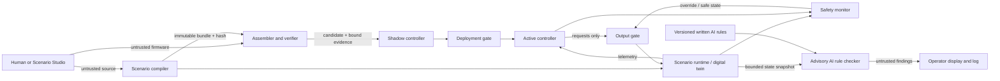

# Architecture

## Status

This document records the version-0 boundaries. `sentinel-core`,
`sentinel-scenario`, `sentinel-safety`, `sentinel-ai-check`, and `sentinel-app`
now exist; remaining crates are introduced only with functional content and
their corresponding tasks.

## Trust and data flow

AI findings, user input, scenario source, firmware source, and the network are outside the trusted computing base. The AI checker has no edge to the assembler, verifier, safety monitor, deployment gate, or output gate. The initial trusted computing base is the S32 decoder/interpreter, memory and capability enforcement, scenario compiler and canonicalization, invariant evaluator, safe-state resolver, output and deployment gates, watchdog, hashing/evidence binding, and the QNX adapter used by those components.

## Crate map

| Crate | Responsibility | Key restriction |
|---|---|---|
| `sentinel-core` | ISA types, assembler, VM, traps, cycles, traces | No AI, UI, network, QNX, or unsafe code |
| `sentinel-scenario` | Schema, validation, canonicalization, MMIO allocation, runtime bundle and deterministic dynamics | No hard-coded rocket semantics in generic machinery |
| `sentinel-safety` | Invariants, safe-state resolution, static checks, exploration, evidence, lifecycle decisions | Narrative and AI scores cannot authorize anything |
| `sentinel-protocol` | Versioned bounded service messages | No pointers or platform handles |
| `sentinel-qnx` | Timing, scheduling, IPC, health and narrowly scoped FFI | Own nearly all target-specific unsafe code |
| `sentinel-ai-check` | Snapshot/rule/finding types, fixtures, test-only OpenAI adapter, local `llama.cpp` adapter, evaluation metadata | Advisory only; no firmware generation, activation, policy, or output-control path |
| `sentinel-app` | Process entry points, orchestration, NDJSON, dashboard and Studio | UI failure cannot affect essential control |

`sentinel-core`, `sentinel-scenario`, `sentinel-safety`, `sentinel-ai-check`,
and `sentinel-app` are implemented workspace members. The core contains ISA
types, canonical decode/encode, source assembly, sparse memory and manifest
types, and the reference interpreter. The scenario crate contains bounded
source parsing, typed validation, canonical compilation, stable MMIO
allocation, and the generic deterministic runtime. `sentinel-safety`
implements typed output decisions, safe-state precedence, abort and authority
containment, and the armed replacement check. `sentinel-ai-check` implements
the bounded snapshot, written-rule, finding, provenance, hash, and
response-validation contract. Current QNX cross-build results are recorded in
`docs/development.md`; the other rows remain planned boundaries.

## Runtime separation

The host-native milestone may use modules or threads. The target architecture separates the safety monitor/output gate, active controller, shadow controller, scenario runtime, compiler/bundle store, verifier/deployment gate, and bounded snapshot publisher into QNX processes. For the hackathon deployment, the advisory checker client and pinned `llama.cpp` instance run on the same QNX deployment host. The model server binds `0.0.0.0:8080` for administration on the restricted lab network, while the checker connects through `127.0.0.1:8080`. Loss of that transport has no control effect. Initial QNX priority intent, pending target measurement, is: safety and output gating; scenario clock and active controller; trace and snapshot transport; shadow controller; verifier.

The AI check is asynchronous with respect to control. The checker receives a size-bounded, schema-validated snapshot plus exact written-rule version and hash. Its structured result links each finding to rule IDs and snapshot fields, and may be displayed or logged only. Timeouts, malformed results, model loss, or stopping the entire checker cannot interrupt the active controller or suppress deterministic alarms.

OpenAI is a development test backend used to exercise the same checker contract and evaluate fixtures. It is not a deployment fallback. The hackathon runtime backend is a pinned deployment-server GGUF model served by `llama.cpp`; model file hash, `llama.cpp` version, launch arguments, prompt contract, and rule-set hash are provenance rather than safety evidence.

## S32 machine boundary

An operator-triggered operation uses one persistent S32 machine invocation, as
recorded in `DEC-012`. Firmware loops, retains its own control state, and halts
only after the operation finishes. The hardware model updates read-only MMIO as
physical state changes, but it does not restart firmware or choose actions.
This is a system boundary: one simulated second or hardware update must never
be implemented by launching the firmware again.

S32 has 32 general registers (`R0` is hardwired to zero), `HI`, `LO`, `PC`, fixed 32-bit little-endian instructions, no delay slots, deterministic virtual cycles, and a sparse 32-bit address space split into program, data, stack, telemetry, commands, feedback, supervisor, and protected safety regions. The accepted exact encoding is in `docs/s32-isa.md`; decode, encode, assembly, execution, trap precedence, memory permissions, manifest capabilities, and cycle budgets are implemented in `sentinel-core`.

The VM accepts explicitly constructed, non-overlapping memory slots and a
validated image manifest. Region type limits the permissions a slot may expose;
the manifest must separately grant each ordinary data, stack, telemetry,
request, feedback, or supervisor access. Program reads and instruction fetches
use the validated program mapping. Safety-control accesses always trap for
ordinary firmware. The current `sentinel-app run` command is a bounded lab
harness with a program mapping and a 64 KiB stack only; scenario compilation
supplies read-only telemetry/feedback slots and write-only actuator-request
slots to the `tank-run` lab harness. Its hardware YAML declares only
register existence, types, and reset values. Firmware receives the addresses
compiled from that inventory, and the assembly owns the demonstrated action
sequence. The `rocket-run` harness applies the same persistent-machine boundary
to the full default scenario: compiled symbols provide read-only telemetry and
feedback plus write-only ordinary actuator requests, while
`rocket-controller.asm` owns its thresholds, waits, interlock reads, sequencing,
and command loop. The harness records operator start and simulated supervisor
approvals separately because ordinary firmware cannot grant them. The manifest
grants exactly those MMIO capabilities.

Hardware-manifest YAML must remain inventory-only. Pressure targets, duration
counters, branches, loops, operating phases, and valve commands are firmware
logic and must not be added to `sentinel.hardware/v0`.

## Scenario boundary

The scenario compiler owns typed channels, phases, transitions, rules,
safe-state declarations, dynamics, faults, stable MMIO allocation, generated
symbols, canonical serialization, and hashing. Runtime code consumes a compiled
immutable bundle and deterministically updates channels, faults, phases, and
rule observations. It reports hold and abort state. `sentinel-safety`
independently consumes those typed results, validates requests, applies
safe-state precedence, and emits accepted, overridden, or rejected output
decisions. Publication and firmware activation are forbidden while the
simulation is armed.

## Lifecycle boundary

A proposal becomes a candidate after parsing and assembly. A candidate may enter shadow only with deterministic validation evidence bound to its bytes and the compiled scenario hash. Activation is a separate deterministic decision. Active and last-known-good state are retained transactionally; rollback requires hash-compatible artifacts and cannot clear a launch-attempt abort latch.
