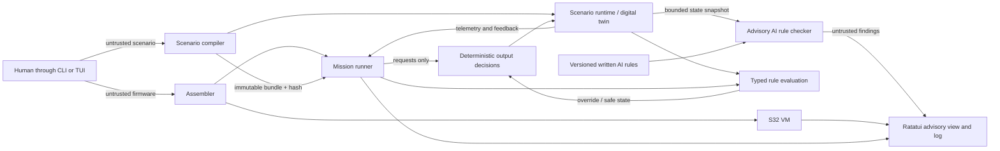

# Architecture

## Status

This document records the version-0 boundaries. `sentinel-core`,
`sentinel-scenario`, `sentinel-safety`, `sentinel-ai-check`, and `sentinel-app`
exist. The TUI is implemented inside `sentinel-app`; no UI types enter the
domain crates.

## Trust and data flow

AI findings, user input, scenario source, firmware source, terminal input, and
the network are untrusted. The AI checker has no edge to the assembler, VM,
typed rule evaluation, or output decisions. The implemented trusted boundary
contains the S32 decoder/interpreter, memory and capability enforcement,
scenario compiler and canonicalization, invariant evaluator, safe-state
resolver, and output-decision logic. The TUI only renders snapshots and sends
bounded commands through those APIs.

## Crate map

| Crate | Responsibility | Key restriction |
|---|---|---|
| `sentinel-core` | ISA types, assembler, VM, traps, cycles, and step results | No AI, UI, network, QNX, or unsafe code |
| `sentinel-scenario` | Schema, validation, canonicalization, MMIO allocation, runtime bundle and deterministic dynamics | No hard-coded rocket semantics in generic machinery |
| `sentinel-safety` | Invariants, safe-state resolution, output-request decisions, and armed replacement denial | Narrative and AI scores cannot authorize anything |
| `sentinel-ai-check` | Snapshot/rule/finding types, fixtures, test-only OpenAI adapter, local `llama.cpp` adapter, evaluation metadata | Advisory only; no firmware generation, activation, policy, or output-control path |
| `sentinel-app` | CLI entry points, typed application sessions, orchestration, and Ratatui interface | UI failure cannot affect deterministic execution or output decisions |

`sentinel-core`, `sentinel-scenario`, `sentinel-safety`, `sentinel-ai-check`,
and `sentinel-app` are implemented workspace members. The TUI remains inside
`sentinel-app`; Ratatui types do not enter the domain crates. The core contains ISA
types, canonical decode/encode, source assembly, sparse memory and manifest
types, and the reference interpreter. The scenario crate contains bounded
source parsing, typed validation, canonical compilation, stable MMIO
allocation, and the generic deterministic runtime. `sentinel-safety`
implements typed output decisions, safe-state precedence, abort and authority
containment, and the armed replacement check. `sentinel-ai-check` implements
the bounded snapshot, written-rule, finding, provenance, hash, and
response-validation contract. Current QNX cross-build results are recorded in
`docs/development.md`.

## Interactive application boundary

The CLI and TUI drive the same typed application sessions. Those sessions own
bounded orchestration and expose immutable snapshots for rendering. The TUI
does not parse CLI text, and rendering cannot directly modify VM memory,
scenario state, safety decisions, or advisory results. User actions become
typed commands that retain the same validation, cycle budgets, and capability
checks as the CLI.

Ratatui renders the complete visible frame from current view state. Terminal
input is collected centrally and translated into tab-specific commands.
Potentially slow advisory network work runs through a bounded worker channel;
VM and mission operation never waits for it. Terminal setup and teardown are
owned by one shell so normal exit, errors, and panics restore raw mode, cursor
state, and the alternate screen.

The implemented views are:

| View | Primary information |
|---|---|
| Assemble | Source, diagnostics, symbols, encoded words, decoded instructions |
| Run | Current instruction, registers, `HI`/`LO`/`PC`, cycles, memory writes, mappings, traps |
| Mission | Firmware position, phase/tick, telemetry, feedback, requests, applied outputs, rules, faults, hold/abort, timeline |
| Advisory | Snapshot/rule identity, freshness, provider health/provenance, validated findings, authority warning |

The interface pins Ratatui 0.29.0 without its optional terminal backends and
uses a small safe ANSI backend plus `stty`. This keeps platform-specific FFI and
`unsafe` code out of the app and passes the QNX 8.0 release cross-build. QNX
operators allocate a pseudo-terminal with `ssh -t`; the CLI remains available
for automation and diagnosis.

## Advisory runtime separation

For the existing hackathon configuration, the advisory checker client and
pinned `llama.cpp` instance may run on the same QNX deployment host. The model
server binds `0.0.0.0:8080` for administration on the restricted lab network,
while the checker connects through `127.0.0.1:8080`. Loss of that transport has
no control effect.

The AI check is asynchronous with respect to mission execution. The checker
receives a size-bounded, schema-validated snapshot plus exact written-rule
version and hash. Its structured result links each finding to rule IDs and
snapshot fields, and may be displayed or logged only. Timeouts, malformed
results, model loss, or stopping the entire checker cannot interrupt the VM or
mission runner or suppress deterministic rule results.

OpenAI is a development test backend used to exercise the same checker contract and evaluate fixtures. It is not a deployment fallback. The hackathon runtime backend is a pinned deployment-server GGUF model served by `llama.cpp`; model file hash, `llama.cpp` version, launch arguments, prompt contract, and rule-set hash are provenance rather than safety evidence.

## S32 machine boundary

An operator-triggered operation uses one persistent S32 machine invocation, as
recorded in `DEC-012`. Firmware loops, retains its own control state, and halts
only after the operation finishes. The hardware model updates read-only MMIO as
physical state changes, but it does not restart firmware or choose actions.
This is a system boundary: one simulated second or hardware update must never
be implemented by launching the firmware again.

S32 has 32 general registers (`R0` is hardwired to zero), `HI`, `LO`, `PC`, fixed 32-bit little-endian instructions, no delay slots, deterministic virtual cycles, and a sparse 32-bit address space split into program, data, stack, telemetry, commands, feedback, supervisor, and protected safety regions. The accepted exact encoding is in `docs/s32-isa.md`; decode, encode, assembly, execution, trap precedence, memory permissions, manifest capabilities, and cycle budgets are implemented in `sentinel-core`.

The VM accepts explicitly constructed, non-overlapping memory slots and a
validated image manifest. Region type limits the permissions a slot may expose;
the manifest must separately grant each ordinary data, stack, telemetry,
request, feedback, or supervisor access. Program reads and instruction fetches
use the validated program mapping. Safety-control accesses always trap for
ordinary firmware. The current `sentinel-app run` command is a bounded lab
harness with a program mapping and a 64 KiB stack only; scenario compilation
supplies read-only telemetry/feedback slots and write-only actuator-request
slots to the mission harness. `mission-run` selects the validated v0 adapter
from the document's declared schema; mission names such as tank and rocket do
not select different product commands. Hardware-inventory missions declare
register existence, types, and reset values, while full scenarios additionally
declare dynamics, rules, phases, faults, and safe states. Firmware receives the
compiled addresses and owns its demonstrated action sequence. The full-scenario
adapter records operator start and simulated supervisor approvals separately
because ordinary firmware cannot grant them. The manifest grants exactly the
compiled MMIO capabilities.

`mission-advice` is the operator's pre-operation advisory step for every
mission type. It compares a bounded, identified mission snapshot with the
configured versioned written rules. The operator and deterministic policy own
the proceed decision. The runner never treats an AI finding, timeout, or
provider failure as permission, denial, or output authority.

Hardware-manifest YAML must remain inventory-only. Pressure targets, duration
counters, branches, loops, operating phases, and valve commands are firmware
logic and must not be added to `sentinel.hardware/v0`.

## Scenario boundary

The scenario compiler owns typed channels, phases, transitions, rules,
safe-state declarations, dynamics, faults, stable MMIO allocation, generated
symbols, canonical serialization, and hashing. Runtime code consumes a compiled
immutable bundle and deterministically updates channels, faults, phases, and
rule observations. It reports hold and abort state. `sentinel-safety`
independently consumes those typed results, validates requests, applies
safe-state precedence, and emits accepted, overridden, or rejected output
decisions. Publication and firmware activation are forbidden while the
simulation is armed.

## Roadmap boundary

The former browser dashboard, Scenario Studio, NDJSON service, static verifier,
bounded exploration, evidence reports, candidate/shadow/active lifecycle, QNX
process split, and watchdog roadmap is retired. Existing types or partial code
related to those ideas may remain, but the project does not claim those
capabilities. The active roadmap is the Ratatui interface in `.agent/plan.md`.
